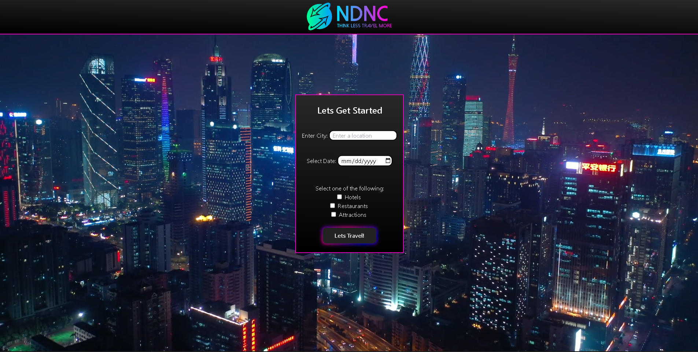

# New Day New City (NDNC)

## Description

[Link to NDNC](https://anthonyfrederick7.github.io/New-Day-New-City/)

  - NDNC is created for travelers that are seeking hotels/restaurants/attractions/POIs within their searched destination city.

  - NDNC is made to make planning faster since you can book a hotel AND view all it's main tourist attractions and places to eat all on one page.

## Installation

N/A

## Usage

  - Upon entry to the website you will be asked what city you are looking to travel to and to select the date.

  - You will also be asked to select at least one option of Hotels/Restaurants/Attractions, if none are selected the page will not continue till one option is selected.

  - Once off the Homepage and on the results page, you can view the options you clicked on as well as view all the data on the map.

## Credits

  - https://github.com/adamhovda
  - https://github.com/codeDevLogan
  - https://github.com/AnthonyFrederick7

## License

N/A